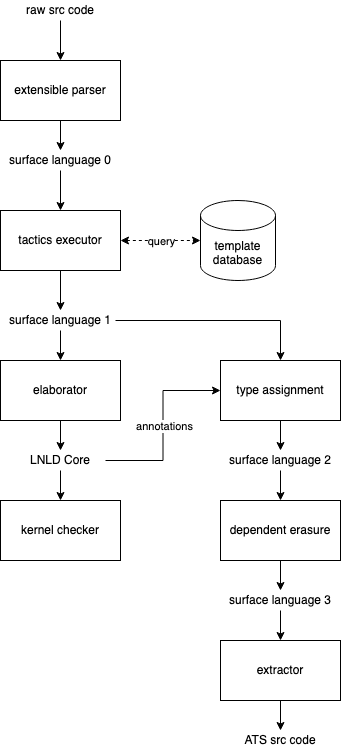

# Project Plan

## Pipeline

## Descriptions

1. `surface language 0`: partial annotation + partial program
2. `surface language 1`: partial annotation + full program
3. `LNLD Core`: dependent linear annotation + core program
4. `surface language 2`: dependent linear annotation + full program
5. `surface language 3`: linear annotation + full program

## Goals

1. general recursion with dependent type
2. LEAN style meta programming with tactics
3. interactive template selection
4. soundness of elaboration to LNLD
5. soundness of dependent erasure in LNLD
6. formalization of ATS linear types
7. soundness of LNLD to ATS extraction
8. characterization of linear data types

## References

* LNLD: https://dl.acm.org/doi/10.1145/2775051.2676969
* ATS: http://www.ats-lang.org/
* DML: https://dl.acm.org/doi/10.1145/292540.292560
* LEAN: https://dl.acm.org/doi/10.1145/3110278